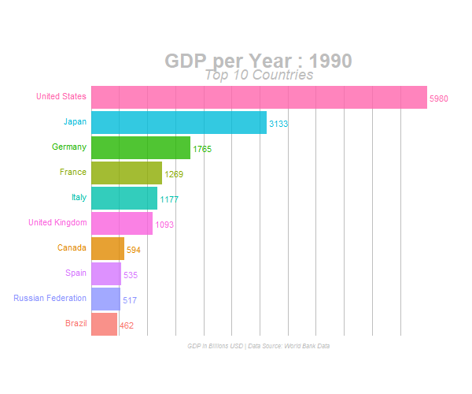

# animated_bar_charts_in_R

The goal of this project is explain how to build Animated Bar Charts in R (which is kinda trending on Social Media these days)

**Disclaimer:** The code used here is heaving borrwoed (*You can say, inspired and copied*) from the answers of this Stack Overflow Question [Animated sorted bar chart with bars overtaking each other](https://stackoverflow.com/questions/53162821/animated-sorted-bar-chart-with-bars-overtaking-each-other)

### Final Output (GIF):



### Reproducibility 

**Packages used**:

+ `gganimate`
+ `tidyverse`

**Session Info**:

```
> sessionInfo()
R version 3.5.1 (2018-07-02)
Platform: x86_64-apple-darwin15.6.0 (64-bit)
Running under: macOS  10.14.3

Matrix products: default
BLAS: /System/Library/Frameworks/Accelerate.framework/Versions/A/Frameworks/vecLib.framework/Versions/A/libBLAS.dylib
LAPACK: /Library/Frameworks/R.framework/Versions/3.5/Resources/lib/libRlapack.dylib

locale:
[1] en_US.UTF-8/en_US.UTF-8/en_US.UTF-8/C/en_US.UTF-8/en_US.UTF-8

attached base packages:
[1] stats     graphics  grDevices utils     datasets  methods   base     

other attached packages:
 [1] gganimate_1.0.1 forcats_0.3.0   stringr_1.4.0   dplyr_0.8.0.1  
 [5] purrr_0.3.2     readr_1.3.1     tidyr_0.8.3     tibble_2.0.1   
 [9] ggplot2_3.1.0   tidyverse_1.2.1

loaded via a namespace (and not attached):
 [1] Rcpp_1.0.1        cellranger_1.1.0  pillar_1.3.1     
 [4] compiler_3.5.1    plyr_1.8.4        prettyunits_1.0.2
 [7] tools_3.5.1       progress_1.2.0    digest_0.6.18    
[10] jsonlite_1.6      lubridate_1.7.4   gtable_0.2.0     
[13] nlme_3.1-137      lattice_0.20-38   png_0.1-7        
[16] pkgconfig_2.0.2   rlang_0.3.2.9000  cli_1.0.1        
[19] rstudioapi_0.9.0  haven_1.1.2       withr_2.1.2      
[22] xml2_1.2.0        httr_1.4.0        hms_0.4.2        
[25] grid_3.5.1        tidyselect_0.2.5  glue_1.3.0       
[28] R6_2.4.0          gifski_0.8.6      readxl_1.1.0     
[31] modelr_0.1.2      tweenr_1.0.1      farver_1.0       
[34] magrittr_1.5      scales_1.0.0      backports_1.1.2  
[37] rvest_0.3.2       assertthat_0.2.0  colorspace_1.3-2 
[40] labeling_0.3      stringi_1.3.1     lazyeval_0.2.1   
[43] munsell_0.5.0     broom_0.5.0       crayon_1.3.4  
```

### Data Source:

The origin input data (`csv`) has been downloaded from [databank.worldbank.org](https://databank.worldbank.org/data/reports.aspx?source=2&series=NY.GDP.MKTP.CD&country=#)

